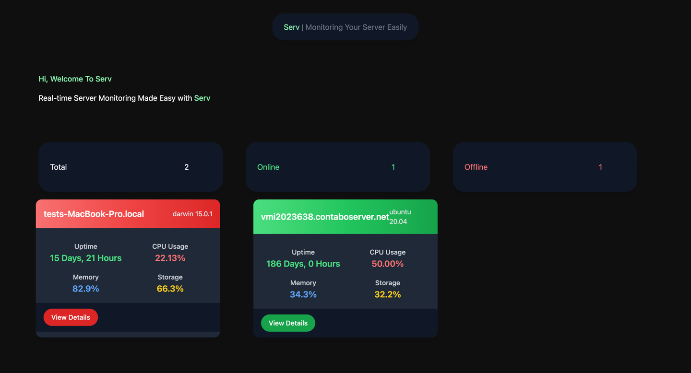

# SERV: Web Application untuk Monitoring Server Kamu secara Realtime dan Mudah

SERV adalah aplikasi berbasis web yang memungkinkan kamu memonitoring server secara realtime dengan mudah. Dengan teknologi yang ringan dan interface yang intuitif, kamu dapat memantau performa server kapan saja dan di mana saja.

---

# Demo



## Tech Stack
**Backend:**
- Golang
- JSON (sebagai Data Store)

**Frontend:**
- Vite
- Vue.js
- Tailwind CSS

---

## Cara Pakai
### **Server Setup**
1. **Clone Repository**
    ```bash
    git clone https://github.com/refaldyrk/serv-core.git
    ```
2. **Konfigurasi Opsional** (jika diperlukan):
   Edit file `docker-compose.yaml` sesuai kebutuhan kamu.

3. **Atur Environment Variables (.env)**
   Buat atau sesuaikan file `.env` untuk konfigurasi server.

4. **Jalankan Docker Compose**
    ```bash
    docker compose up -d
    ```
   Perintah ini akan menjalankan **SERV Server** dan **SERV Dashboard** sekaligus.

   **Buka di browser:** [http://localhost:3298](http://localhost:3298) *(Port default)*.

---

### **Client Setup**
1. **Clone Repository**
    ```bash
    git clone https://github.com/refaldyrk/serv-core.git
    ```

2. **Jalankan Binary Application**
   Temukan aplikasi sesuai OS kamu di folder `dist`, lalu jalankan aplikasi tersebut.

3. **Daftarkan URL Server**
   Daftarkan URL **SERV Server** seperti contoh berikut:
    ```bash
    serv reg http://localhost:9090
    ```

4. **Koneksi Client ke Server**
   Hubungkan client kamu ke server menggunakan **key**. (Key ini dapat diperoleh dari administrator server.)
    ```bash
    serv conn <key>
    ```

5. **Jalankan SERV Client**
    ```bash
    serv run
    ```

   Untuk kemudahan, kamu juga dapat mendaftarkan **SERV Client** agar berjalan di background.

---

## Cara Mendapatkan Key
Saat menjalankan:
```bash
docker compose up -d
```
**Key** akan dicetak di log. Kamu dapat menemukannya di sana untuk menghubungkan client ke server.

**Contoh log output:**
```
[INFO] Your SERV connection key: ABCDE12345
```

---

## Fitur Utama
- **Monitoring Realtime:** Pantau performa server secara langsung dengan visualisasi yang interaktif.
- **Mudah diatur:** Menggunakan konfigurasi minimal.
- **Ringan:** Dikembangkan dengan Golang dan Vue.js untuk efisiensi.
- **Customizable:** Mudah disesuaikan sesuai kebutuhanmu.
